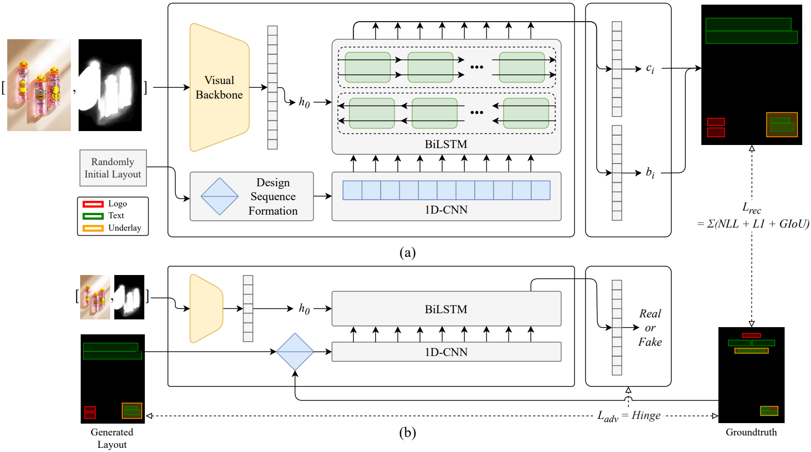
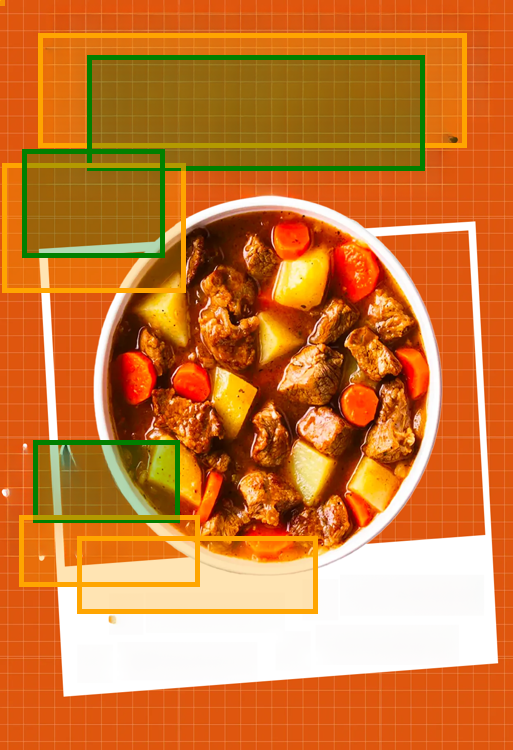
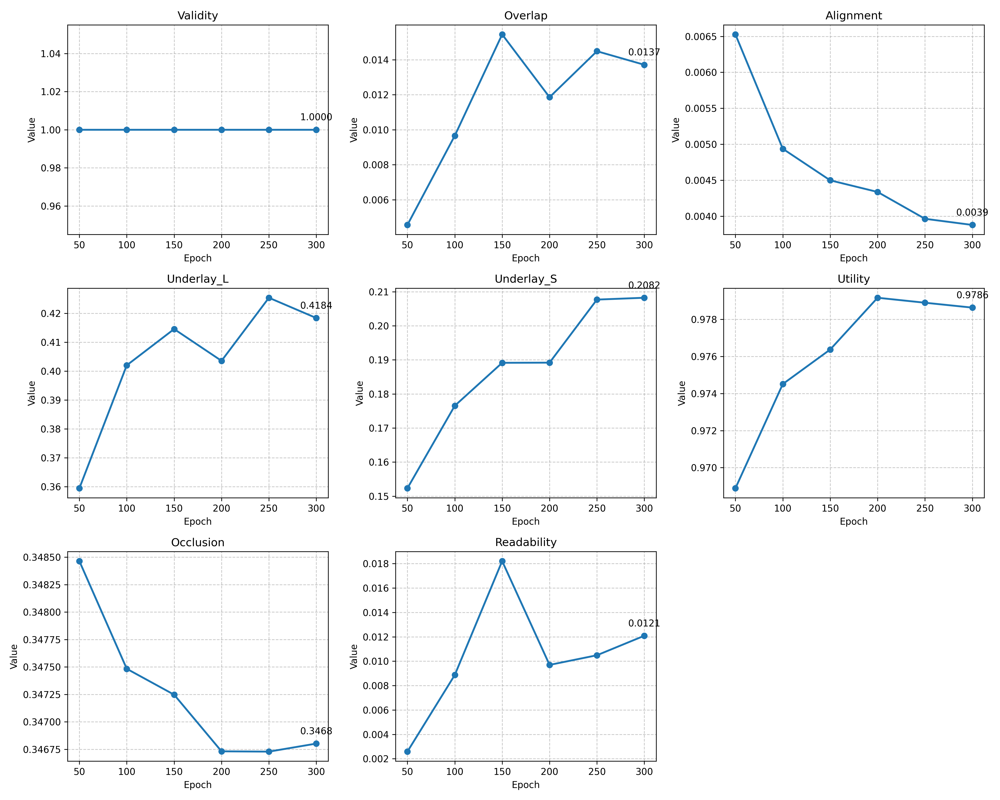
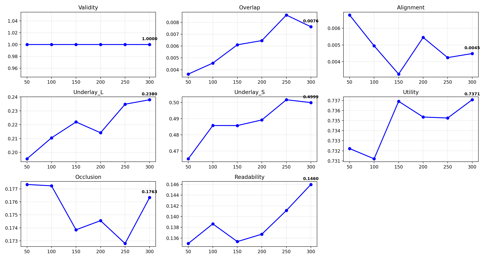

<div align="center">
<h1 align="center">PosterLayout Reproduction (PyTorch & Jittor)</h1>

<p align="center">
  <b>Nankai University | Sprout Program (新芽计划)</b>
</p>

<p align="center">
  <a href="https://github.com/Jittor/jittor"></a>
  <a href="https://pytorch.org/"></a>
  <a href="./LICENSE"></a>
  <a href="https://github.com/aaaaa985/PosterLayout-Reproduction"></a>
</p>

<p align="center">
  <a href="https://openaccess.thecvf.com/content/CVPR2023/papers/Hsu_PosterLayout_A_New_Benchmark_and_Approach_for_Content-Aware_Automatic_Poster_CVPR_2023_paper.pdf"></a>
  <a href="https://github.com/PKU-Venzu/PosterLayout"></a>
</p>
---

## English

### 🚀Introduction

This repository contains the reproduction and framework migration of the paper **"PosterLayout: A New Benchmark and Approach for Content-aware Automatic Poster Layout"**. 

This project is the final result of the **"AI Practice Course (Elementary)"** at **Nankai University** and belongs to the **"Sprout Program" (新芽计划)** of Nankai University. The work includes:
1. A complete reproduction of the original model using **PyTorch**.
2. A successful migration to the **Jittor (计图)** framework, a high-performance deep learning framework developed by Tsinghua University.

### 🏗️Model Overview (PosterLayout / DS-GAN)

The PosterLayout model, also known as **DS-GAN** (Design Sequence GAN), is a content-aware poster layout generation framework. 
- **Generator**: Takes a background image and a saliency map as input. A visual backbone extracts contextual features ($h_0$), while a 1D-CNN and a BiLSTM reason over the design sequence to predict element categories ($c_i$) and bounding boxes ($b_i$).
- **Discriminator**: Evaluates the compatibility between the generated layout and the background.
- **Optimization**: The model is supervised by a combination of reconstruction loss ($L_{rec}$: NLL + L1 + GIoU) and adversarial loss ($L_{adv}$: Hinge loss).

<p align="center">
  
  <br>
  <em>Figure: Overview of the DS-GAN architecture.</em>
</p>

### 💡Migration Highlights (Technical Details)

During the migration from PyTorch to Jittor, the following optimizations were implemented based on framework characteristics:

- **Custom LSTM Layer**: Manually implemented the bidirectional LSTM structure in Jittor to ensure seamless loading of pre-trained weights.
- **Pooling Operator Adaptation**: Addressed Jittor's strict input size validation for pooling layers by using a "Wide-Concat" strategy to bypass dimension constraints.
- **Memory Synchronization**: Utilized jt.sync in the discriminator logic to precisely control synchronization, solving data consistency issues with the ArgMax operator in GPU environments.
- **Cross-Framework Alignment**: Designed loss mapping to ensure the Jittor version achieves parity with the PyTorch version in convergence speed and evaluation metrics.

### 🎨Results Showcase

I provide a comprehensive evaluation of the model performance, including visual samples, quantitative metrics (Triple-line Table format), and training convergence plots for both frameworks. The model demonstrates a strong ability to generate content-aware layouts that respect the visual hierarchy and saliency of the background images.

#### Visual Comparison

<p align="center">
  
  
  <br><em>PyTorch Implementation Results</em>
</p>

<p align="center">
  
  
  <br><em>Jittor Implementation Results</em>
</p>

#### Quantitative Results

The following table summarizes the performance at **Epoch 300**. (↑) indicates higher is better, (↓) indicates lower is better. 

<table>   <thead>     <tr>       <th>Method / Framework</th>       <th>Epoch</th>       <th>Val(↑)</th>       <th>Ove(↓)</th>       <th>Ali(↓)</th>       <th>Und_L(↑)</th>       <th>Und_S(↑)</th>       <th>Uti(↑)</th>       <th>Occ(↓)</th>       <th>Rea(↓)</th>     </tr>   </thead>   <tbody>     <tr>       <td><b>(Ours) PyTorch</b></td>       <td>300</td>       <td>1.0000</td>       <td>0.0137</td>       <td><b>0.0039</b></td>       <td><b>0.4184</b></td>       <td>0.2082</td>       <td><b>0.9786</b></td>       <td>0.3468</td>       <td><b>0.0121</b></td>     </tr>     <tr>       <td><b>(Ours) Jittor</b></td>       <td>300</td>       <td>1.0000</td>       <td><b>0.0076</b></td>       <td>0.0045</td>       <td>0.2380</td>       <td><b>0.4999</b></td>       <td>0.7371</td>       <td><b>0.1763</b></td>       <td>0.1460</td>     </tr>   </tbody> </table>

#### Training Convergence

To demonstrate the stability of our reproduction, we provide the metric trends recorded during the training process for both PyTorch and Jittor versions.

<p align="center">      <br><em>Metrics Trend: PyTorch Version</em> </p>

<p align="center">      <br><em>Metrics Trend: Jittor Version</em> </p>

### 🔍Result Analysis

- **Framework Consistency**: Both frameworks achieved a **Validity of 1.0**, indicating that the generated layouts are fully compliant with basic geometric constraints.
- **Metric Highlights**:
  - The **PyTorch** version excelled in **Utility (0.9786)** and **Readability (0.0121)**, showing superior performance in avoiding visual centers and maintaining text clarity.
  - The **Jittor** version demonstrated better performance in **Overlap (0.0076)** and **Underlay_S (0.4999)**, suggesting that Jittor implementation might be more effective in controlling element occlusion and maintaining underlay containment.

- **Convergence**: As shown in the trend plots, both implementations show stable convergence across all 300 epochs, validating the effectiveness of our hyperparameters and migration logic.

### 📖Usage

1. **Data Preparation**: Follow the instructions in [data/README.md](https://www.google.com/url?sa=E&q=./data/README.md) to download the **PosterLLaVa** dataset. Ensure the images and JSON files are placed in the `data/` directory.

2. **Download Weights**: Download the pretrained `.pth` (PyTorch) or `.jtp` (Jittor) weights from [Releases](https://www.google.com/url?sa=E&q=../../releases) and place them into the `model_weight/` folder.

3. **Training & Inference**:
   Navigate to the desired framework directory:

   ```
   cd jittor_version  # or cd pytorch_version
   python main.py     # For training
   python infer.py    # For batch inference
   python eval.py     # For metrics calculation and visualization
   ```

### 🛠️Installation & Setup

#### Pytorch Version

**Install Python Dependencies**:

```
pip install -r requirements.txt -i https://pypi.tuna.tsinghua.edu.cn/simple
```

#### Jittor Version

1. **Install Python Dependencies**:

   ```
   python -m pip install -r requirements.txt -i https://pypi.tuna.tsinghua.edu.cn/simple
   ```

2. **Initialize Jittor CUDA Environment** (For GPU servers like AutoDL):
   Jittor requires a C++ compilation environment. Use the following command to let Jittor automatically download and configure the built-in CUDA and cuDNN:

   ```
   python -m jittor_utils.install_cuda
   ```

3. **Fix System Paths** (Handling `libGL` or missing headers):
   If using older disk images or encountering `cudnn.h not found`, execute:

   ```
   # 1. Try creating a symbolic link (requires sudo)
   sudo ln -s /usr/include/cudnn.h /usr/local/cuda/include/cudnn.h 2>/dev/null
   
   # 2. If sudo is not available, configure environment variables
   export C_INCLUDE_PATH=$C_INCLUDE_PATH:/usr/include
   export CPLUS_INCLUDE_PATH=$CPLUS_INCLUDE_PATH:/usr/include
   # Resolve conflicts between OpenMP and MKL
   export KMP_DUPLICATE_LIB_OK=TRUE
   export MKL_SERVICE_FORCE_INTEL=1
   ```

### 📓Technical Notes

#### Pytorch Version

- **Backbone Library**: The `timm` (PyTorch Image Models) library is required to initialize the ResNet backbones. The implementation supports loading both local weights and official pre-trained models.
- **Hungarian Matcher**: Similar to the original DETR architecture, we utilize `scipy.optimize.linear_sum_assignment` in `RecLoss.py` to solve the bipartite matching problem between predicted and ground-truth boxes.
- **Geometric Operations**: Advanced bounding box operations (such as `box_area`) are handled via `torchvision.ops` to ensure computational efficiency and gradient stability.
- **Visualization & Evaluation**:
  - `matplotlib` is used for real-time training progress visualization.
  - `opencv-python-headless` is recommended for server environments (e.g., AutoDL) to prevent `libGL` library errors while calculating Sobel gradients for the **Readability** metric.

#### Jittor Version

- **Role of Scipy**: Used in `RecLoss.py` to execute the **Hungarian Matcher**, which is the core matching logic of the DETR-like architecture.
- **OpenCV-Python-Headless**: Chosen to avoid `libGL.so` missing errors during `eval.py` debugging. For headless servers, this is best practice as it avoids installing large GUI system libraries.
- **Torch Usage**: Note that `torch` is **only** used in `convert_weight.py` to read the original `.pth` weights. The training and inference processes are 100% independent of PyTorch.

### 📂Repository Structure

```
.
├── pytorch_version/    # PyTorch implementation (Original Reproduction)
├── jittor_version/     # Jittor implementation (Framework Migration)
├── data/               # Dataset instructions and annotation files
├── model_weight/       # Pretrained weights (Please download from Releases)
└── assets/             # Images for README and documentation
```

### 🤝Acknowledgements

- This project belongs to the **"Sprout Program" (新芽计划)** of Nankai University.
- Special thanks to the teaching team of the **"AI Practice Course"** at the College of Artificial Intelligence, Nankai University, for their guidance.
- Thanks to the **Jittor** team for providing an excellent domestic deep learning framework.

### 📜Citations

```
@inproceedings{hsu2023posterlayout,
  title={PosterLayout: A New Benchmark and Approach for Content-aware Automatic Poster Layout},
  author={Hsu, Hsiao-Yuan and others},
  booktitle={Proceedings of the IEEE/CVF Conference on Computer Vision and Pattern Recognition},
  year={2023}
}
```

## 中文说明

### 🚀项目简介

本项目是对论文 **"PosterLayout: A New Benchmark and Approach for Content-aware Automatic Poster Layout"** 的复现实现。

本仓库是**南开大学**《人工智能实践课（初级）》课程的大作业成果，属于南开大学**“新芽计划”**。主要工作包括：
1. 使用 **PyTorch** 对原论文进行了基准复现。
2. 将模型完整迁移至国产高性能深度学习框架 **Jittor (计图)**。

### 🏗️模型简介 (PosterLayout / DS-GAN)

PosterLayout 的核心模型为 **DS-GAN**（设计序列生成对抗网络），它是一种感知内容的自动海报布局生成框架：
- **生成器 (Generator)**：输入背景图与显著图。通过视觉骨干网络提取图像特征 ($h_0$)，结合 1D-CNN 和双向 LSTM (BiLSTM) 对设计序列进行建模，最终预测每个元素的类别 ($c_i$) 和坐标 ($b_i$)。
- **判别器 (Discriminator)**：评估生成的布局序列与背景图像的融合合理性，判断其为真 (Real) 或假 (Fake)。
- **损失函数**：结合了重构损失 ($L_{rec}$，包含分类 NLL、位置 L1 及 GIoU 损失) 与对抗损失 ($L_{adv}$，采用 Hinge Loss)。

<p align="center">
  
  <br>
  <em>图：DS-GAN 架构概览</em>
</p>

### 💡迁移亮点与技术细节 (Migration Highlights)

从 PyTorch 迁移至 Jittor 的过程中，针对框架特性进行了以下优化：

- **自定义 LSTM 层**：在 Jittor 中手动实现了双向 LSTM 结构，确保能够完美加载预训练权重。
- **池化算子适配**：针对 Jittor 池化层对输入尺寸的严格校验，通过维度扩充（Wide-Concat）策略绕过了尺寸限制。
- **显存同步优化**：在 GAN 的判别器逻辑中，利用 `jt.sync` 精准控制同步时机，解决了 ArgMax 算子在 GPU 环境下的数据一致性问题。
- **跨框架对齐**：通过精心设计的 Loss 映射，确保了 Jittor 版本在收敛速度和评价指标上与 PyTorch 版本保持一致。

### 🎨成果展示

我对模型性能进行了全面评估，包括视觉示例、定量指标对比（三线表格式）以及两个框架的训练收敛曲线。模型展现出了优秀的视觉内容感知能力，能够生成符合视觉层级并避开背景显著区域的布局。

#### 视觉效果对比

<p align="center">
  
  
  <br><em>PyTorch Implementation Results</em>
</p>

<p align="center">
  
  
  <br><em>Jittor Implementation Results</em>
</p>

#### 定量指标对比

下表汇总了模型在 **第 300 轮 (Epoch 300)** 的表现。（↑）表示数值越高越好，（↓）表示越低越好。

<table>   <thead>     <tr>       <th>Method / Framework</th>       <th>Epoch</th>       <th>Val(↑)</th>       <th>Ove(↓)</th>       <th>Ali(↓)</th>       <th>Und_L(↑)</th>       <th>Und_S(↑)</th>       <th>Uti(↑)</th>       <th>Occ(↓)</th>       <th>Rea(↓)</th>     </tr>   </thead>   <tbody>     <tr>       <td><b>(Ours) PyTorch</b></td>       <td>300</td>       <td>1.0000</td>       <td>0.0137</td>       <td><b>0.0039</b></td>       <td><b>0.4184</b></td>       <td>0.2082</td>       <td><b>0.9786</b></td>       <td>0.3468</td>       <td><b>0.0121</b></td>     </tr>     <tr>       <td><b>(Ours) Jittor</b></td>       <td>300</td>       <td>1.0000</td>       <td><b>0.0076</b></td>       <td>0.0045</td>       <td>0.2380</td>       <td><b>0.4999</b></td>       <td>0.7371</td>       <td><b>0.1763</b></td>       <td>0.1460</td>     </tr>   </tbody> </table>

#### 训练收敛趋势

为了展示复现的稳定性，我们记录并提供了 PyTorch 和 Jittor 版本在训练过程中的指标变化曲线。

<p align="center">      <br><em>Metrics Trend: PyTorch Version</em> </p>

<p align="center">      <br><em>Metrics Trend: Jittor Version</em> </p>

### 🔍结果分析

- **框架一致性**：两个框架均达到了 **1.0 的 Validity（有效性）**，说明生成的布局完全符合基础几何规范。
- **指标亮点**：
  - **PyTorch 版本**在 **Utility (0.9786)** 和 **Readability (0.0121)** 表现更优，说明其在避让视觉中心和保持文字清晰度方面有更强的能力。
  - **Jittor 版本**在 **Overlap (0.0076)** 和 **Underlay_S (0.4999)** 指标上表现更好，这表明 Jittor 实现在控制元素重叠以及处理底块（Underlay）包含关系方面更为出色。

- **收敛性**：如趋势图所示，两个版本在 300 轮训练中各项指标均呈现稳定的收敛趋势，验证了实验参数设置与迁移逻辑的有效性。

### 📖使用说明 (中文)

1. **数据准备**: 请参考 [data/README.md](https://www.google.com/url?sa=E&q=./data/README.md) 下载 **PosterLLaVa** 数据集，并确保图像文件夹与 JSON 标注文件正确放置在 `data/` 目录下。

2. **权重下载**: 从 [Releases](https://www.google.com/url?sa=E&q=../../releases) 下载预训练权重（PyTorch 格式为 `.pth`，Jittor 格式为 `.jtp`），并放入 `model_weight/` 文件夹。

3. **训练与推理**:
   进入对应的框架目录执行脚本：

   ```
   cd jittor_version  # 或 cd pytorch_version
   python main.py     # 启动训练
   python infer.py    # 批量推理生成布局
   python eval.py     # 计算评价指标并进行可视化保存
   ```

### 🛠️安装与环境配置

#### Pytorch 版本

安装 Python 依赖：

```
pip install -r requirements.txt -i https://pypi.tuna.tsinghua.edu.cn/simple
```

#### Jittor 版本

1. **安装 Python 依赖**：

   ```
   python -m pip install -r requirements.txt -i https://pypi.tuna.tsinghua.edu.cn/simple
   ```

2. **初始化 Jittor CUDA 环境** (针对 AutoDL 或 GPU 服务器)：
   Jittor 涉及 C++ 代码编译，必须配置开发环境。执行以下命令让 Jittor 自动下载并配置内置的 CUDA 和 cuDNN：

   ```
   python -m jittor_utils.install_cuda
   ```

3. **修复系统路径** (处理 `libGL` 或头文件缺失)：
   如果使用的是老版本镜像，或遇到 `cudnn.h not found`，请执行：

   ```
   # 1. 尝试建立软链接 (需要 sudo)
   sudo ln -s /usr/include/cudnn.h /usr/local/cuda/include/cudnn.h 2>/dev/null
   
   # 2. 如果没有 sudo 权限，配置环境变量
   export C_INCLUDE_PATH=$C_INCLUDE_PATH:/usr/include
   export CPLUS_INCLUDE_PATH=$CPLUS_INCLUDE_PATH:/usr/include
   # 解决 OpenMP 与底层 MKL 冲突
   export KMP_DUPLICATE_LIB_OK=TRUE
   export MKL_SERVICE_FORCE_INTEL=1
   ```

### 📓技术说明

#### Pytorch 版本

- **骨干网络库**：本项目使用 `timm` (PyTorch Image Models) 库来初始化 ResNet 骨干网络。代码支持从本地路径加载权重，也支持在线下载官方预训练模型。
- **匈牙利匹配**：参考 DETR 架构，我们在 `RecLoss.py` 中调用了 `scipy.optimize.linear_sum_assignment` 来求解预测框与真实框之间的二分图匹配问题。
- **几何算子**：复杂的边界框计算（如 `box_area`）通过 `torchvision.ops` 实现，以确保计算效率和梯度的稳定性。
- **可视化与评估**：
  - 使用 `matplotlib` 在训练过程中生成实时的布局效果图和指标曲线。
  - 在服务器环境（如 AutoDL）中，建议使用 `opencv-python-headless`。这可以避免在计算 **Readability（可读性）** 指标所需的 Sobel 梯度时，因缺少系统图形库而触发的 `libGL` 报错。

#### Jittor 版本

- **Scipy 的作用**：在 `RecLoss.py` 中用于执行**匈牙利匹配算法** (Hungarian Matcher)，是该架构中核心的匹配逻辑。
- **OpenCV-Python-Headless**：我在调试 `eval.py` 时发现 `import cv2` 会报 `libGL.so` 缺失。对于没有显示器的服务器，安装 Headless 版本是最佳实践，能省去安装几百 MB 系统图形库的麻烦。
- **PyTorch 的角色**：明确说明 `torch` **仅**在 `convert_weight.py` 脚本中用于读取原始 `.pth` 权重，训练和推理过程完全不依赖 PyTorch。

###  📂仓库结构

```text
.
├── pytorch_version/    # PyTorch implementation
├── jittor_version/     # Jittor implementation
├── data/               # Dataset instructions and annotation files
├── model_weight/       # Placeholder for model checkpoints
└── assets/             # Images for README and documentation
```

### 🤝致谢

- 本项目属于南开大学**“新芽计划”**项目成果。
- 感谢南开大学人工智能学院《人工智能实践课》教学团队在复现过程中的悉心指导。
- 感谢 **Jittor (计图)** 团队提供了优秀的国产深度学习框架支持。

### 📜引用

```
@inproceedings{hsu2023posterlayout,
  title={PosterLayout: A New Benchmark and Approach for Content-aware Automatic Poster Layout},
  author={Hsu, Hsiao-Yuan and others},
  booktitle={Proceedings of the IEEE/CVF Conference on Computer Vision and Pattern Recognition},
  year={2023}
}

```
